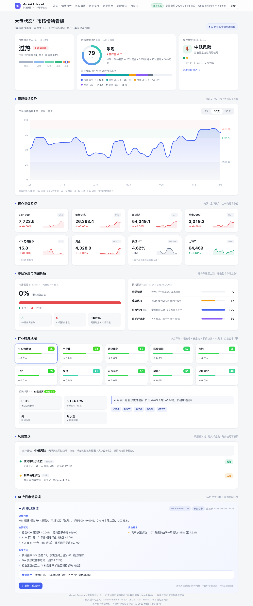

# Market Pulse AI · 市场脉搏智能看板

> 聚合价格、资金、情绪、波动、宏观五类信号，压缩成一个 0-100 的市场情绪指数（MSI），并由 AI 生成每日市场解读——**每天打开 30 秒，知道市场现在发生了什么**。

**在线演示**：https://feifei-aidev.github.io/market-pulse-ai/market-pulse-dashboard.html （每个美股交易日收盘后自动更新）



## 核心模块

| 模块 | 内容 |
|---|---|
| 状态总览 | 市场状态（Regime）· MSI 情绪环 + 五因子贡献 · 风险等级 |
| 情绪趋势 | MSI 7/30/90 天走势，含悲观/乐观/过热阈值分区 |
| 核心指数 | S&P 500 / 纳指 / 道指 / 罗素2000 / VIX / 黄金 / 美债10Y / BTC |
| 市场宽度 | 上涨占比、新高新低、量能热度 + 情绪四拆解 |
| 行业热度 | 10 大行业温度地图，点击展开详情与 AI 舆情 |
| 风险雷达 | 规则触发制红黄绿信号，每条可解释 |
| AI 解读 | 总体判断 / 主要驱动 / 风险提示 / 关注方向 + 策略提示 |

## MSI 情绪评分模型

```
MSI = 30%×趋势 + 25%×资金 + 20%×情绪 + 15%×波动 + 10%×宏观
```

- **趋势**：均线位置（MA20/50/200）+ 20日动量 + 新高新低比
- **资金**：量能热度 + 量价代理（估算，UI 标注"估"）
- **情绪**：大盘股样本涨跌比 + VIX 反向代理（估算，UI 标注"估"）
- **波动**：VIX 一年分位（反向）+ VIX3M/VIX 期限结构
- **宏观**：10Y 利率月变化 + 信用利差（FRED 真实 OAS 或 HYG/LQD 代理）+ 美元月变化

状态映射：0-30 悲观 · 30-50 谨慎 · 50-70 偏强 · 70-85 乐观 · 85-100 过热。
每个分数都可拆解到因子贡献（"为什么是这个分"），这是区别于黑箱评分的关键设计。完整公式见 [market-pulse-plan.md](market-pulse-plan.md)。

## 数据架构与透明度

```
Yahoo Finance (yfinance, 免费无需Key)
        │  每日收盘后 GitHub Actions 运行 fetch_data.py
        ▼
data/snapshot.js  ──►  看板 HTML（真实模式）
        缺失时          └─ 无快照自动回退内置模拟数据（演示模式）
```

- **真实数据**：指数、VIX、行业 ETF、利率、美元、信用代理、MSI 历史
- **透明代理**：资金流与期权情绪无免费源，采用量价代理并在 UI 标注"（估）"
- **可选增强**（在仓库 Secrets 配置后自动启用，不配置则回退）：
  - `FRED_API_KEY`：真实 HY 信用利差（OAS）
  - `OPENAI_API_KEY` / `LLM_BASE_URL` / `LLM_MODEL`：LLM 生成每日解读（OpenAI 兼容接口）

## 快速开始

```bash
pip install yfinance pandas numpy
python3 fetch_data.py        # 生成 data/snapshot.js
# 双击 market-pulse-dashboard.html 即可（真实数据模式）
# 删除 data/snapshot.js 则回退模拟数据演示模式
```

自动部署：推送到 GitHub → 开启 Pages → Actions 每交易日 UTC 21:00 自动更新快照并提交。

## 项目结构

```
market-pulse-dashboard.html   看板（真实/模拟双模式，单文件）
fetch_data.py                 采集 + MSI 计算 + 风险规则 + 解读生成
market-pulse-plan.md          产品规划设计文档（模型公式/权重/路线图）
data/snapshot.js              数据快照（脚本生成，勿手改）
.github/workflows/            每日自动更新
docs/                         截图
```

## 免责声明

本项目为产品作品集演示，所有输出为基于历史数据的统计判断，不构成投资建议。
